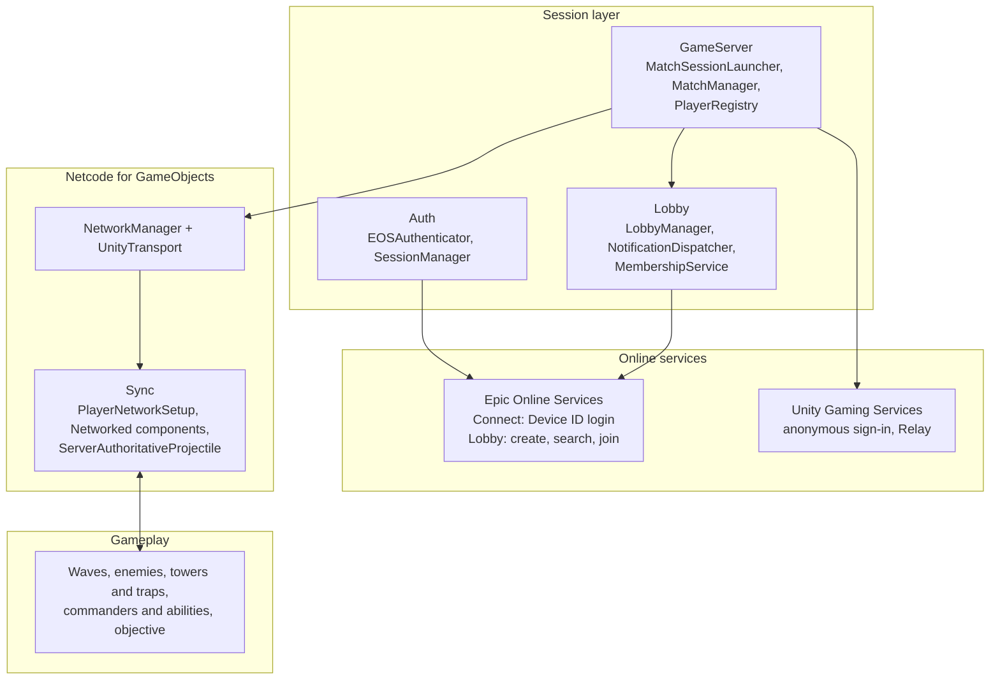
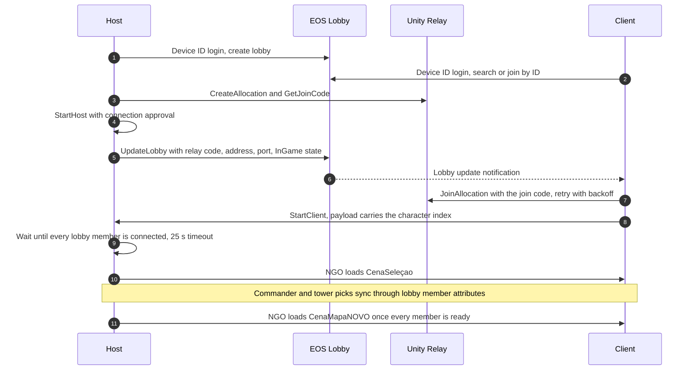

# ExoBeast

**English** · **[Português (Brasil)](README.pt-BR.md)**

**Co-op tower defense for 1–4 players built in Unity 6, with online multiplayer on Epic Online Services, Unity Relay and Netcode for GameObjects.**

ExoBeast is a student team project incubated at Brasília Game Hub. Players pick a commander, build towers and traps, and defend an objective against waves of enemies, alone or with up to three friends online. This README covers the technical side: the stack, how the systems fit together, and the problems solved along the way.

## Contents

- [Team](#team)
- [Tech stack](#tech-stack)
- [Architecture](#architecture)
- [Multiplayer](#multiplayer)
- [Gameplay systems](#gameplay-systems)
- [Editor tooling and audio](#editor-tooling-and-audio)
- [Engineering challenges](#engineering-challenges)
- [Testing and documentation](#testing-and-documentation)
- [Project layout](#project-layout)
- [Getting started](#getting-started)
- [Status and limitations](#status-and-limitations)

## Team

| Member | Areas |
|---|---|
| [@Sitr3n01](https://github.com/Sitr3n01) (José Gilberto) | Multiplayer and networking end to end: EOS authentication and lobbies, Unity Relay, the NGO session flow, gameplay synchronization and network optimization. Also the FMOD integration, the Exo Config and Exo Bridge editor tools, the EditMode test suite and the technical docs. Pull requests [#1](https://github.com/Matt040205/ExoBeast/pull/1), [#3](https://github.com/Matt040205/ExoBeast/pull/3), [#4](https://github.com/Matt040205/ExoBeast/pull/4) and [#5](https://github.com/Matt040205/ExoBeast/pull/5). |
| [@Matt040205](https://github.com/Matt040205) | Repository owner. Gameplay systems, UI flow, level and scene work, art integration. |
| [@amigolindu](https://github.com/amigolindu) | Character and enemy animation, UI, VFX. |

## Tech stack

Versions come from `ProjectSettings/ProjectVersion.txt` and `Packages/packages-lock.json`.

| Area | Technology |
|---|---|
| Engine | Unity 6.3 LTS (`6000.3.10f1`), Universal Render Pipeline 17.3 |
| Language | C# |
| Networking | Netcode for GameObjects 1.12.0, Unity Transport 2.6.0 |
| Online services | Epic Online Services through the PlayEveryWare EOS Plugin 5.1.3 (Connect and Lobby interfaces); Unity Gaming Services: Authentication 3.6.0 and Multiplayer Services 2.2.1 (Relay) |
| Multiplayer tooling | Multiplayer Play Mode 2.0.2, Multiplayer Tools 2.2.1 |
| Gameplay | AI Navigation 2.0.11 (NavMesh), Input System 1.14.0, Cinemachine 3.1.4, Animation Rigging 1.3.1, DOTween |
| Rendering and VFX | URP 17.3, VFX Graph 17.3, Unity Toon Shader 0.13.4-preview, UI Particle |
| Audio | FMOD for Unity 2.03.10, BetterFMOD 1.1.0 (embedded package) |
| Tooling | In-house editor tools (Exo Config, Exo Bridge), Blender 5.2 add-on in Python, FBX Exporter 5.1.5, Polybrush 1.1.8 |
| Testing | Unity Test Framework 1.6.0 (NUnit, EditMode), headless Blender contract test |
| Workflow | Git and GitHub with feature branches and pull requests |

## Architecture

The session layer (`Assets/Multiplayer`) is the only code that talks to EOS and Unity Gaming Services. Gameplay code works with Netcode for GameObjects (`NetworkBehaviour`, RPCs, `NetworkVariable`s), and the selection and scene flow reach the lobby only through the public API of `LobbyManager`. The host acts as the server for all gameplay state.

## Multiplayer

> Owner: [@Sitr3n01](https://github.com/Sitr3n01). Code in [`Assets/Multiplayer`](Assets/Multiplayer) (about 9.1k lines of C#), plus the network side of players, enemies, towers and abilities.

The topology is host-client (listen server). EOS handles identity (anonymous Device ID login on the Connect interface) and lobbies. Unity Relay carries the game traffic in builds, so players behind NAT can connect without port forwarding. Netcode for GameObjects runs on Unity Transport.

### Session flow

The connection logic lives in [`MatchSessionLauncher`](Assets/Multiplayer/GameServer/MatchSessionLauncher.cs):

- In the Editor, Multiplayer Play Mode clones connect over `127.0.0.1` without Relay. In builds, if the Relay allocation fails, the host falls back to direct IP and publishes a `__NO_RELAY__` sentinel instead of a join code.
- UGS anonymous sign-in and Relay joins retry with backoff.
- Each step of the launch re-checks that the lobby is still active, and shuts NGO down cleanly if it isn't.
- The character choice travels in the 4-byte connection-approval payload. The host spawns player objects itself (`CreatePlayerObject = false`) with the right commander prefab.

### Scene flow

`NetworkBootstrap` → `MenuScene` → `LobbyScene` → `CenaSeleçao` → `CenaMapaNOVO` → `Win` / `Lose`

In multiplayer, every transition after the lobby is server-driven through `NetworkManager.SceneManager`. The host only leaves `CenaSeleçao` once every lobby member is ready and every connected client has an authoritative pick in `CharacterChoiceCache`. Singleplayer goes through `EscolherCaminho`, a run map with random modifiers, before the match.

### Authority model

| State | Authority | Mechanism |
|---|---|---|
| Player movement | Owner | `ClientNetworkTransform` (owner-authoritative `NetworkTransform`). `PlayerNetworkSetup` turns on input, cameras and local-only objects for the owner and disables them on remote copies. |
| Player animation | Owner | Locomotion parameters in a quantized 2-byte `NetworkVariable`, written only when they change. Triggers such as jump and attack go through `NetworkAnimator`. |
| Enemy AI and pathing | Server | `EnemyController` and `NavMeshAgent` are enabled only on the host |
| Health, shields, death | Server | `NetworkVariable`s with server write permission. Clients request damage through `ServerRpc`s. |
| Towers and traps | Server | Spawned by the server, with state set before `Spawn()` so it ships in the initial snapshot |
| Projectile hits | Server | `ServerAuthoritativeProjectile` resolves damage on the server; clients only render |
| Match state | Server | `MatchManager` exposes state, wave and time as `NetworkVariable`s |
| Player identity | Server | `PlayerIdentityBridge` maps the NGO `clientId` to the EOS `ProductUserId` |

### Lobby data model

| Scope | Attributes |
|---|---|
| Lobby | `LOBBY_NAME`, `MAP_NAME`, `MAX_PLAYERS`, `CURRENT_PLAYERS`, `IS_PUBLIC`, `LOBBY_STATE`, `SERVER_ADDRESS`, `SERVER_PORT`, `RELAY_CODE` |
| Member | `DISPLAY_NAME`, `CHARACTER_INDEX`, `TOWER_INDEXES`, `IS_READY`, `IS_HOST` |

Lobbies live in the `ExoBeasts` bucket. Public searches always filter on `LOBBY_STATE == WaitingForPlayers`, and players can also join by lobby ID. `PartySlotLayout` assigns each player's slots: the first is their commander, the rest are their towers.

### Lobby refactor

`LobbyManager` started as one class that called EOS, handled notifications, tracked members, started the match and wired the UI. An eight-sprint refactor split it into focused pieces without changing its public contract. It ran against a ratchet-style quality gate, where no metric may get worse, and is documented in [`docs/archive/Refactoring`](docs/archive/Refactoring).

| Extracted | Responsibility |
|---|---|
| [`MatchSessionLauncher`](Assets/Multiplayer/GameServer/MatchSessionLauncher.cs) | Match start: Relay, NGO host and client start, wait for all players, first scene load |
| [`LobbyNotificationDispatcher`](Assets/Multiplayer/Lobby/LobbyNotificationDispatcher.cs) | EOS lobby and member notifications |
| [`LobbyMembershipService`](Assets/Multiplayer/Lobby/LobbyMembershipService.cs) | Member list, ordering and attribute reads |
| [`EosLobbyModHelper`](Assets/Multiplayer/Core/EosLobbyModHelper.cs) | Lobby and member attribute writes, previously duplicated in two classes |
| `LobbyButtonBinder`, `NetworkAddressHelper`, `PartySlotLayout` | UI wiring, local IP lookup, and the slot layout shared by UI, spawn and selection |

### Network optimizations

The optimization work ran in sprints. Each change is marked in the code as `OPTIMIZATION (Sprint N / Item X)`:

- **Animation state in 2 bytes.** Movement speed and vertical velocity are quantized into one `INetworkSerializable` struct (one byte each, the signed value offset by 128) and written only when they change.
- **Targeted RPCs.** Damage and immunity popups go only to the attacking client through `ClientRpcParams`. Owner-only notifications, such as a cooldown reset, go only to the owner.
- **Lobby traffic.** Member attribute writes are debounced to 250 ms (initialization uses an immediate variant), and lobby searches have a 2 s cooldown with a cached result.
- **EOS ticking.** The EOS platform was being ticked twice, by the wrapper and by the PlayEveryWare manager; now it is ticked once.
- **Server CPU.** On the server, towers pick targets from the registry of active enemies that `HordeManager` keeps, instead of running a physics query on every update. Physics remains as a fallback, using `OverlapSphereNonAlloc` with a reusable buffer, and enemy targeting does the same. Ability cooldown updates iterate without allocations.
- **RPC cleanup.** Empty `ClientRpc`s were removed: two stubs in `MatchManager`, and a broadcast that fired on every ultimate.

### Credentials and builds

Real EOS credentials never go into git. They load from the first source available:

1. Environment variables, for CI/CD: `EOS_PRODUCT_ID`, `EOS_SANDBOX_ID`, `EOS_DEPLOYMENT_ID`, `EOS_CLIENT_ID`, `EOS_CLIENT_SECRET`, `EOS_ENCRYPTION_KEY`.
2. A gitignored `EOSCredentials.json` at the repository root, created from `EOSCredentials.json.template`.
3. Runtime configs in `StreamingAssets/EOS/`, generated by [`EOSConfigGenerator`](Assets/Editor/EOSConfigGenerator.cs).

`EOSConfigGenerator` runs as a build preprocessor (`IPreprocessBuildWithReport`, `callbackOrder = -100`) and when entering Play Mode. A build with missing credentials fails with a `BuildFailedException`. In the `EOSConfig` ScriptableObject the credential fields are `[NonSerialized]`, so they never get written into the `.asset`. Logs mask the `ClientId` and never print the `ClientSecret` or `EncryptionKey`. Details in [CREDENTIALS_SETUP.md](Assets/Multiplayer/CREDENTIALS_SETUP.md).

## Gameplay systems

Built by the whole team. They're summarized here because the network layer touches all of them.

- **Data-driven content.** `CharacterBase` is a single ScriptableObject for both commanders and towers (`isCommander` sets the role). Enemies use `EnemyDataSO`, traps use `TrapDataSO`, abilities use `Ability` and `PassivaAbility`. Upgrades chain `UpgradePath` → `Upgrade` → `StatModifier` (additive or multiplicative).
- **Waves.** `HordeManager` runs on the server, with preparation phases, scripted `WaveConfig` lists or a random mode, and spawn paths with patrol points. Enemy stats scale with the wave: HP grows 15% per wave, and attack, speed and armor grow linearly.
- **Enemies.** NavMesh agents with slow, slip and knockback effects, in ground and flying types. Enemies and VFX come from pools.
- **Towers.** `TowerController` and `TowerAbilitySystem` give each tower three upgrade paths with five levels each. An upgrade can attach a `TowerBehavior` such as multi-shot, piercing, bleeding, armor shred or an aura.
- **Traps.** Each trap has two prefabs: a visual one for the placement preview, and a network logic prefab that the server spawns only after the player confirms. A trap can be restricted to the path, to off-path ground, or allowed anywhere.
- **Commanders.** Ayame, Brunhilde, Coral and Sylvie each have a passive, two abilities (Q and E) and an ultimate (X). Ultimate charge is a `NetworkVariable` fed by time and by damage dealt. `DamageContext` carries the attacker, critical hits, the source of the damage and who should see the feedback.
- **Run structure.** Two currencies (geodites and dark ether) and the Rastros upgrade tree for commanders. In singleplayer, a run map draws modifiers for each node: 15% none, 30% positive, 30% negative, 25% both.

## Editor tooling and audio

By [@Sitr3n01](https://github.com/Sitr3n01).

### Exo Config

A Unity Editor tool (**Assets > Exo Prefabs > Organizar...**) that turns a selected FBX into project-ready assets for three categories: characters, monsters and environment.

- A seven-step pipeline in which each step reports to a structured `ExoBuildReport`: `ResolvePaths` → `ImportAssets` → `Material` → `BuildPrefab` → `Animator` → `NetworkRegistration` → `Validate`.
- Commanders are built as Prefab Variants of the base player prefab, so a re-import keeps everything except model, material and animator.
- `NetworkRegistrationStep` adds the result to the NGO prefab list. `ValidateStep` checks that each fileID written into a ScriptableObject really exists in the saved prefab YAML (see [challenge 5](#engineering-challenges)).
- Configuration lives in a versioned `ExoToolConfig.asset`, which replaced per-machine `EditorPrefs` and generated code.
- The logic lives in `ExoBeasts.ExoConfig.Core`, an Editor-only assembly with `noEngineReferences: true`, so it runs in unit tests without the engine.

### Exo Bridge (Blender 5.2 → Unity)

- A Blender add-on ([`Tools/Blender/ExoBridge`](Tools/Blender/ExoBridge)) exports a versioned package containing:
  - an `exo-package.json` manifest with the schema, a UUID, Blender and add-on versions, axes, scale, SHA-256 hashes, material slots and actions;
  - the FBX model;
  - the textures;
  - one FBX per animation action;
  - a zipped `.blend`.
- The Unity window (**Exo Bridge > Pacotes**) previews the package. It blocks unknown schemas, hash mismatches, path traversal, unsupported files and wrong axis or scale settings. Nothing is imported without explicit confirmation, and files are backed up before being overwritten.
- The contract is tested on both sides: a headless Blender test (`blender --background --python`) and EditMode tests on the manifest.

### Audio

- FMOD for Unity 2.03.10, with BetterFMOD 1.1.0 as an embedded package.
- Gameplay code never calls FMOD directly. [`ExoAudioService`](Assets/CoreScripts/Audio/ExoAudioService.cs) is the single facade for one-shots, 3D one-shots, loops, bus volume and stop-all, backed by an event catalog asset.

## Engineering challenges

1. **Scene sync broke inside Multiplayer Play Mode clones.**
   - **Symptom:** clients threw `Scene Hash X does not exist in HashToBuildIndex table` on the first scene sync.
   - **Cause:** in MPPM clones, Unity's native build scene list can come back empty even when `EditorBuildSettings` is correct, and NGO 1.12 builds its hash table from that list.
   - **Fix:** [`NetworkSceneTableFixer`](Assets/Multiplayer/Core/NetworkSceneTableFixer.cs) forces a native resync. Right after `StartHost` or `StartClient`, it repopulates `HashToBuildIndex` through reflection, using a port of NGO's internal XXHash32. `BuildSceneListGuard` keeps the build list canonical at edit time.
2. **Slow clients missed the first scene load.**
   - **Cause:** each client goes through EOS propagation, UGS sign-in, the Relay join and the NGO handshake, which takes 5–15 s in builds, so a fixed delay wasn't enough.
   - **Fix:** the host waits until NGO's connected clients match the lobby members, with a 25 s timeout. It also validates the scene's build index before loading, and every peer logs the load in `VerifySceneBeforeLoading`.
3. **`IsServer` is silently false before `Spawn()`.**
   - **Symptom:** pre-spawn initializers guarded by `if (!IsServer) return;` were skipped. `NetworkVariable`s shipped with default values, trap build limits were ignored and the HUD showed zeros. This hit the trap system twice.
   - **Fix:** pre-spawn code now checks `NetworkManager.Singleton.IsServer`, and the rule is marked in the code and in the pattern catalog.
4. **Traps ignored remote players.**
   - **Cause:** with owner-authoritative movement, the server moves remote players by assigning `transform.position`, which doesn't fire `OnTriggerEnter`. Spikes, heal zones and teleporters only worked for the host.
   - **Fix:** every spawned player gets a kinematic `Rigidbody` at runtime, and the `CharacterController` stays enabled on remote copies.
5. **Enemies vanished only in standalone builds.**
   - **Cause:** a Prefab Variant dragged into a ScriptableObject could keep the fileID of the original prefab. The Editor resolves that reference through the GUID, but the player build doesn't, so it came back null.
   - **Fix:** the variants were relinked, and Exo Config's `ValidateStep` now checks this automatically.
6. **The host froze after spawning.**
   - **Cause:** an exception between disabling and re-enabling `PlayerInput` inside a coroutine left input off for good.
   - **Fix:** input setup is now an atomic sequence, and side effects run only after the input bridge is up.

Challenges 3 to 6 belong to a catalog of eight NGO pitfalls (P1–P8) learned from real bugs. The catalog is [PADROES_NGO.md](Assets/CoreScripts/Docs/PADROES_NGO.md), in Portuguese, and it's required reading before changing any `NetworkBehaviour`.

## Testing and documentation

- **Tests:** about 140 NUnit EditMode test methods, around 200 cases with parameterized inputs, in [`Assets/Tests/Editor`](Assets/Tests/Editor). They cover:
  - the Exo Config core: naming, path resolution, override maps, picker items, legacy settings migration, fileID checks, ScriptableObject reference parsing;
  - the Exo Bridge manifest;
  - menu scene validation;
  - selection and enemy scaling.
- **Blender add-on:** a headless contract test.
- **Agent guidelines:** part of the work was done with AI coding agents following the repository's guidelines ([AGENTS.md](AGENTS.md)). Those commits carry `Co-Authored-By` trailers.

Technical docs, in Portuguese:

| Topic | Document |
|---|---|
| Documentation index | [docs/INDEX.md](docs/INDEX.md) |
| Multiplayer overview | [docs/multiplayer.md](docs/multiplayer.md) |
| NGO patterns learned from real bugs | [PADROES_NGO.md](Assets/CoreScripts/Docs/PADROES_NGO.md) |
| Current multiplayer state and change log | [Estado_Atual_Multiplayer.md](Assets/CoreScripts/Docs/Estado_Atual_Multiplayer.md) |
| Onboarding | [ONBOARDING.md](Assets/CoreScripts/Docs/ONBOARDING.md) |
| Exo Config and Exo Bridge | [GUIA_EXO_CONFIG.md](Assets/CoreScripts/Docs/GUIA_EXO_CONFIG.md), [GUIA_EXO_BRIDGE.md](Assets/CoreScripts/Docs/GUIA_EXO_BRIDGE.md) |
| EOS authentication and credentials | [AUTHENTICATION_GUIDE.md](Assets/Multiplayer/Docs/AUTHENTICATION_GUIDE.md), [CREDENTIALS_SETUP.md](Assets/Multiplayer/CREDENTIALS_SETUP.md) |
| Checklists: characters, maps, audio, release | [docs/checklists](docs/checklists) |

## Project layout

| Path | Contents |
|---|---|
| `Assets/Multiplayer/` | Network code: `Auth`, `Lobby`, `GameServer`, `Sync`, `Core`, `Testing`, plus the NGO prefab list in `Setup/` |
| `Assets/CoreScripts/` | Gameplay systems: managers, enemies, towers and traps, combat, audio, VFX, UI, and technical docs in `Docs/` |
| `Assets/Personagens/` | Commanders, the ability system and the player controllers |
| `Assets/Armadilhas/` | Trap logic |
| `Assets/Editor/` | Exo Config, Exo Bridge, the EOS config generator and the build scene guard |
| `Assets/Tests/Editor/` | EditMode tests |
| `Assets/Cenas/` | Scenes |
| `Tools/Blender/ExoBridge/` | Blender add-on and its contract test |
| `docs/` | Documentation index, multiplayer overview and checklists |

## Getting started

### Requirements

- Unity `6000.3.10f1`. Other versions break serialization in ScriptableObjects and prefabs.
- An EOS product in the Epic Developer Portal, for authentication and lobbies.
- For Relay in builds, the Unity Cloud project linked in `ProjectSettings`, with Relay enabled. Editor and Multiplayer Play Mode sessions connect directly and don't need it.

### Running

1. Clone the repository and open the project root in Unity Hub with `6000.3.10f1`.
2. Copy `EOSCredentials.json.template` to `EOSCredentials.json` and fill in your EOS values (see [Credentials and builds](#credentials-and-builds)).
3. Open `Assets/Cenas/NetworkBootstrap.unity` and press Play.
4. For local multiplayer, open **Window > Multiplayer Play Mode** and add a virtual player. Create a lobby in the main Editor and join it from the clone.

## Status and limitations

- Student team project in active development: a vertical slice with the full multiplayer flow and the core gameplay loop.
- Not done yet:
  - validation of NAT traversal over the public internet;
  - reconnecting after a disconnect;
  - host migration;
  - a dedicated server build.
