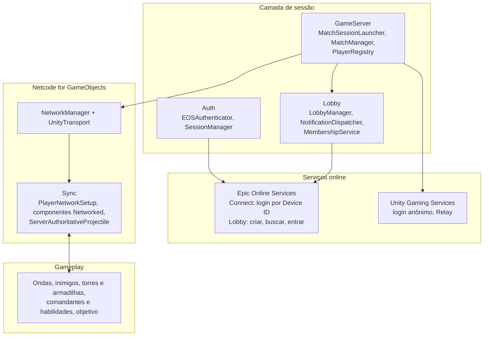
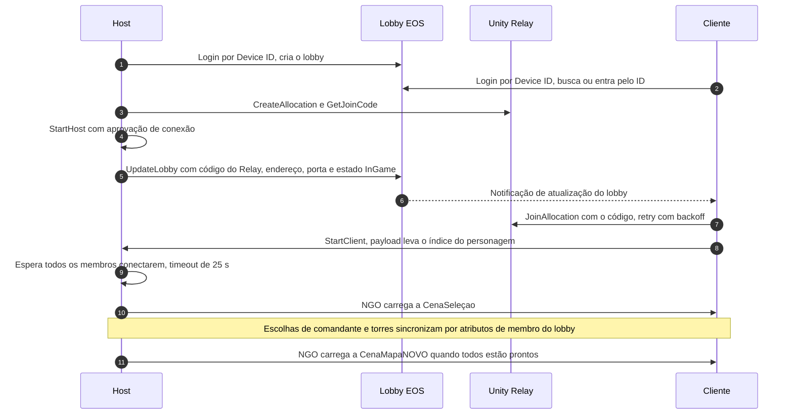

# ExoBeast

**[English](README.md)** · **Português (Brasil)**

**Tower defense cooperativo para 1 a 4 jogadores feito em Unity 6, com multiplayer online sobre Epic Online Services, Unity Relay e Netcode for GameObjects.**

O ExoBeast é um projeto de equipe acadêmico incubado no Brasília Game Hub. O jogador escolhe um comandante, constrói torres e armadilhas e defende um objetivo contra ondas de inimigos, sozinho ou com até três amigos online. Este README cobre a parte técnica: a stack, como os sistemas se encaixam e os problemas resolvidos no caminho.

## Sumário

- [Equipe](#equipe)
- [Stack técnica](#stack-técnica)
- [Arquitetura](#arquitetura)
- [Multiplayer](#multiplayer)
- [Sistemas de gameplay](#sistemas-de-gameplay)
- [Ferramentas de editor e áudio](#ferramentas-de-editor-e-áudio)
- [Desafios de engenharia](#desafios-de-engenharia)
- [Testes e documentação](#testes-e-documentação)
- [Estrutura do projeto](#estrutura-do-projeto)
- [Como rodar](#como-rodar)
- [Status e limitações](#status-e-limitações)

## Equipe

| Integrante | Áreas |
|---|---|
| [@Sitr3n01](https://github.com/Sitr3n01) (José Gilberto) | Multiplayer e rede de ponta a ponta: autenticação e lobbies EOS, Unity Relay, fluxo de sessão no NGO, sincronização de gameplay e otimização de rede. Também a integração com FMOD, as ferramentas de editor Exo Config e Exo Bridge, a suíte de testes EditMode e a documentação técnica. Pull requests [#1](https://github.com/Matt040205/ExoBeast/pull/1), [#3](https://github.com/Matt040205/ExoBeast/pull/3), [#4](https://github.com/Matt040205/ExoBeast/pull/4) e [#5](https://github.com/Matt040205/ExoBeast/pull/5). |
| [@Matt040205](https://github.com/Matt040205) | Dono do repositório. Sistemas de gameplay, fluxo de UI, level design e cenas, integração de arte. |
| [@amigolindu](https://github.com/amigolindu) | Animação de personagens e inimigos, UI, VFX. |

## Stack técnica

As versões vêm de `ProjectSettings/ProjectVersion.txt` e `Packages/packages-lock.json`.

| Área | Tecnologia |
|---|---|
| Engine | Unity 6.3 LTS (`6000.3.10f1`), Universal Render Pipeline 17.3 |
| Linguagem | C# |
| Rede | Netcode for GameObjects 1.12.0, Unity Transport 2.6.0 |
| Serviços online | Epic Online Services via PlayEveryWare EOS Plugin 5.1.3 (interfaces Connect e Lobby); Unity Gaming Services: Authentication 3.6.0 e Multiplayer Services 2.2.1 (Relay) |
| Ferramentas de multiplayer | Multiplayer Play Mode 2.0.2, Multiplayer Tools 2.2.1 |
| Gameplay | AI Navigation 2.0.11 (NavMesh), Input System 1.14.0, Cinemachine 3.1.4, Animation Rigging 1.3.1, DOTween |
| Renderização e VFX | URP 17.3, VFX Graph 17.3, Unity Toon Shader 0.13.4-preview, UI Particle |
| Áudio | FMOD for Unity 2.03.10, BetterFMOD 1.1.0 (pacote embutido) |
| Ferramentas | Ferramentas de editor próprias (Exo Config, Exo Bridge), addon do Blender 5.2 em Python, FBX Exporter 5.1.5, Polybrush 1.1.8 |
| Testes | Unity Test Framework 1.6.0 (NUnit, EditMode), teste de contrato headless no Blender |
| Fluxo de trabalho | Git e GitHub com branches de feature e pull requests |

## Arquitetura

A camada de sessão (`Assets/Multiplayer`) é o único código que fala com o EOS e o Unity Gaming Services. O código de gameplay trabalha com o Netcode for GameObjects (`NetworkBehaviour`, RPCs, `NetworkVariable`s), e o fluxo de seleção e de cenas só acessa o lobby pela API pública do `LobbyManager`. O host atua como servidor de todo o estado de gameplay.

## Multiplayer

> Responsável: [@Sitr3n01](https://github.com/Sitr3n01). Código em [`Assets/Multiplayer`](Assets/Multiplayer) (cerca de 9,1 mil linhas de C#), mais a parte de rede de jogadores, inimigos, torres e habilidades.

A topologia é host-cliente (listen server). O EOS cuida da identidade (login anônimo por Device ID na interface Connect) e dos lobbies. O Unity Relay transporta o tráfego do jogo nas builds, então jogadores atrás de NAT conectam sem abrir portas. O Netcode for GameObjects roda sobre o Unity Transport.

### Fluxo de sessão

A lógica de conexão fica no [`MatchSessionLauncher`](Assets/Multiplayer/GameServer/MatchSessionLauncher.cs):

- No Editor, os clones do Multiplayer Play Mode conectam por `127.0.0.1`, sem Relay. Nas builds, se a alocação no Relay falhar, o host cai para IP direto e publica um sentinela `__NO_RELAY__` no lugar do código.
- O login anônimo no UGS e a entrada no Relay tentam de novo com backoff.
- Cada passo do início da partida confere se o lobby continua ativo e, se não estiver, encerra o NGO de forma limpa.
- A escolha de personagem viaja nos 4 bytes do payload de aprovação de conexão. O próprio host spawna os jogadores (`CreatePlayerObject = false`) com o prefab de comandante certo.

### Fluxo de cenas

`NetworkBootstrap` → `MenuScene` → `LobbyScene` → `CenaSeleçao` → `CenaMapaNOVO` → `Win` / `Lose`

No multiplayer, toda transição depois do lobby é conduzida pelo servidor através do `NetworkManager.SceneManager`. O host só sai da `CenaSeleçao` quando todos os membros do lobby estão prontos e todo cliente conectado tem uma escolha autoritativa no `CharacterChoiceCache`. No singleplayer, antes da partida, o jogo passa pela `EscolherCaminho`, um mapa de run com modificadores sorteados.

### Modelo de autoridade

| Estado | Autoridade | Mecanismo |
|---|---|---|
| Movimento do jogador | Dono | `ClientNetworkTransform` (`NetworkTransform` com autoridade do dono). O `PlayerNetworkSetup` liga input, câmeras e objetos locais só para o dono e os desliga nas cópias remotas. |
| Animação do jogador | Dono | Parâmetros de locomoção quantizados num `NetworkVariable` de 2 bytes, escrito só quando muda. Gatilhos como pulo e ataque passam pelo `NetworkAnimator`. |
| IA e pathfinding dos inimigos | Servidor | `EnemyController` e `NavMeshAgent` ficam ativos apenas no host |
| Vida, escudo e morte | Servidor | `NetworkVariable`s com escrita só do servidor. Clientes pedem dano por `ServerRpc`. |
| Torres e armadilhas | Servidor | Spawnadas pelo servidor, com o estado definido antes do `Spawn()` para já seguir no snapshot inicial |
| Acerto de projéteis | Servidor | O `ServerAuthoritativeProjectile` resolve o dano no servidor; os clientes só desenham |
| Estado da partida | Servidor | O `MatchManager` expõe estado, onda e tempo como `NetworkVariable`s |
| Identidade do jogador | Servidor | O `PlayerIdentityBridge` liga o `clientId` do NGO ao `ProductUserId` do EOS |

### Modelo de dados do lobby

| Escopo | Atributos |
|---|---|
| Lobby | `LOBBY_NAME`, `MAP_NAME`, `MAX_PLAYERS`, `CURRENT_PLAYERS`, `IS_PUBLIC`, `LOBBY_STATE`, `SERVER_ADDRESS`, `SERVER_PORT`, `RELAY_CODE` |
| Membro | `DISPLAY_NAME`, `CHARACTER_INDEX`, `TOWER_INDEXES`, `IS_READY`, `IS_HOST` |

Os lobbies ficam no bucket `ExoBeasts`. Buscas públicas sempre filtram por `LOBBY_STATE == WaitingForPlayers`, e também dá para entrar pelo ID do lobby. O `PartySlotLayout` define os slots de cada jogador: o primeiro é o comandante, os demais são as torres dele.

### Refatoração do lobby

O `LobbyManager` começou como uma única classe que chamava o EOS, tratava notificações, controlava membros, iniciava a partida e ligava a UI. Uma refatoração em oito sprints dividiu essa classe em partes focadas sem mudar o contrato público dela. Ela seguiu um quality gate no estilo ratchet, em que nenhuma métrica pode piorar, e está documentada em [`docs/archive/Refactoring`](docs/archive/Refactoring).

| Extraído | Responsabilidade |
|---|---|
| [`MatchSessionLauncher`](Assets/Multiplayer/GameServer/MatchSessionLauncher.cs) | Início da partida: Relay, start do host e do cliente NGO, espera por todos, carga da primeira cena |
| [`LobbyNotificationDispatcher`](Assets/Multiplayer/Lobby/LobbyNotificationDispatcher.cs) | Notificações de lobby e de membros do EOS |
| [`LobbyMembershipService`](Assets/Multiplayer/Lobby/LobbyMembershipService.cs) | Lista de membros, ordenação e leitura de atributos |
| [`EosLobbyModHelper`](Assets/Multiplayer/Core/EosLobbyModHelper.cs) | Escrita de atributos de lobby e de membro, antes duplicada em duas classes |
| `LobbyButtonBinder`, `NetworkAddressHelper`, `PartySlotLayout` | Ligação da UI, descoberta do IP local, e o layout de slots usado por UI, spawn e seleção |

### Otimizações de rede

As otimizações foram feitas em sprints. Cada mudança está marcada no código como `OPTIMIZATION (Sprint N / Item X)`:

- **Estado de animação em 2 bytes.** Velocidade de movimento e velocidade vertical são quantizadas numa struct `INetworkSerializable` (um byte cada; o valor com sinal é deslocado em 128) e só são escritas quando mudam.
- **RPCs direcionados.** Popups de dano e de imunidade vão só para o cliente que atacou, via `ClientRpcParams`. Avisos que só interessam ao dono, como o reset de cooldown, vão só para ele.
- **Tráfego de lobby.** Escritas de atributos de membro têm debounce de 250 ms (a inicialização usa uma variante imediata), e buscas de lobby têm cooldown de 2 s com resultado em cache.
- **Tick do EOS.** A plataforma EOS recebia tick duas vezes, do wrapper e do manager da PlayEveryWare; agora recebe uma vez só.
- **CPU do servidor.** No servidor, as torres escolhem alvo pelo registro de inimigos ativos mantido pelo `HordeManager`, em vez de rodar uma consulta de física a cada update. A física continua como fallback, com `OverlapSphereNonAlloc` e buffer reutilizável, e a busca de alvo dos inimigos faz o mesmo. A atualização de cooldowns das habilidades percorre as listas sem alocar memória.
- **Limpeza de RPCs.** Foram removidos `ClientRpc`s vazios: dois stubs no `MatchManager` e um broadcast disparado a cada ultimate.

### Credenciais e builds

Credenciais reais do EOS nunca vão para o git. Elas são carregadas da primeira fonte disponível:

1. Variáveis de ambiente, para CI/CD: `EOS_PRODUCT_ID`, `EOS_SANDBOX_ID`, `EOS_DEPLOYMENT_ID`, `EOS_CLIENT_ID`, `EOS_CLIENT_SECRET`, `EOS_ENCRYPTION_KEY`.
2. Um `EOSCredentials.json` ignorado pelo git, na raiz do repositório, criado a partir do `EOSCredentials.json.template`.
3. Configs de runtime em `StreamingAssets/EOS/`, geradas pelo [`EOSConfigGenerator`](Assets/Editor/EOSConfigGenerator.cs).

O `EOSConfigGenerator` roda como pré-processador de build (`IPreprocessBuildWithReport`, `callbackOrder = -100`) e ao entrar no Play Mode. Uma build sem credenciais falha com `BuildFailedException`. No ScriptableObject `EOSConfig`, os campos de credencial são `[NonSerialized]`, então nunca vão para o `.asset`. Os logs mascaram o `ClientId` e nunca imprimem `ClientSecret` nem `EncryptionKey`. Detalhes em [CREDENTIALS_SETUP.md](Assets/Multiplayer/CREDENTIALS_SETUP.md).

## Sistemas de gameplay

Feitos pela equipe toda. Estão resumidos aqui porque a camada de rede passa por todos eles.

- **Conteúdo orientado a dados.** O `CharacterBase` é um único ScriptableObject para comandantes e torres (`isCommander` define o papel). Inimigos usam `EnemyDataSO`, armadilhas usam `TrapDataSO`, habilidades usam `Ability` e `PassivaAbility`. Upgrades encadeiam `UpgradePath` → `Upgrade` → `StatModifier` (aditivo ou multiplicativo).
- **Ondas.** O `HordeManager` roda no servidor, com fases de preparação, listas de `WaveConfig` roteirizadas ou modo aleatório, e caminhos de spawn com pontos de patrulha. Os atributos dos inimigos escalam com a onda: a vida cresce 15% por onda; ataque, velocidade e armadura crescem de forma linear.
- **Inimigos.** Agentes de NavMesh com efeitos de lentidão, escorregão e knockback, em tipos terrestre e voador. Inimigos e VFX vêm de pools.
- **Torres.** `TowerController` e `TowerAbilitySystem` dão a cada torre três caminhos de upgrade com cinco níveis cada. Um upgrade pode acoplar um `TowerBehavior`, como tiro múltiplo, perfuração, sangramento, redução de armadura ou aura.
- **Armadilhas.** Cada armadilha tem dois prefabs: um visual, para a prévia de posicionamento, e um prefab de lógica de rede que o servidor só spawna depois que o jogador confirma. Uma armadilha pode ser restrita ao caminho, ao terreno fora dele, ou valer em qualquer lugar.
- **Comandantes.** Ayame, Brunhilde, Coral e Sylvie têm cada um uma passiva, duas habilidades (Q e E) e uma ultimate (X). A carga da ultimate é um `NetworkVariable` alimentado por tempo e pelo dano causado. O `DamageContext` leva o atacante, o crítico, a origem do dano e quem deve ver o feedback.
- **Estrutura de run.** Duas moedas (geoditas e éter sombrio) e a árvore de melhorias Rastros para os comandantes. No singleplayer, um mapa de run sorteia modificadores para cada nó: 15% nenhum, 30% positivo, 30% negativo, 25% ambos.

## Ferramentas de editor e áudio

Por [@Sitr3n01](https://github.com/Sitr3n01).

### Exo Config

Ferramenta de editor da Unity (**Assets > Exo Prefabs > Organizar...**) que transforma um FBX selecionado em assets prontos para o projeto, em três categorias: personagens, monstros e ambiente.

- Pipeline de sete etapas, em que cada etapa registra o resultado num `ExoBuildReport` estruturado: `ResolvePaths` → `ImportAssets` → `Material` → `BuildPrefab` → `Animator` → `NetworkRegistration` → `Validate`.
- Comandantes são montados como Prefab Variants do prefab base do jogador, então uma reimportação preserva tudo menos modelo, material e animator.
- O `NetworkRegistrationStep` adiciona o resultado à lista de prefabs do NGO. O `ValidateStep` confere se cada fileID gravado num ScriptableObject existe de fato no YAML do prefab salvo (ver o [desafio 5](#desafios-de-engenharia)).
- A configuração fica num `ExoToolConfig.asset` versionado, que substituiu `EditorPrefs` por máquina e código gerado.
- A lógica fica no `ExoBeasts.ExoConfig.Core`, um assembly só de Editor com `noEngineReferences: true`, por isso roda em testes unitários sem a engine.

### Exo Bridge (Blender 5.2 → Unity)

- Um addon do Blender ([`Tools/Blender/ExoBridge`](Tools/Blender/ExoBridge)) exporta um pacote versionado com:
  - um manifesto `exo-package.json` com o schema, um UUID, as versões do Blender e do addon, eixos, escala, hashes SHA-256, slots de material e actions;
  - o modelo em FBX;
  - as texturas;
  - um FBX por action de animação;
  - o `.blend` compactado.
- A janela na Unity (**Exo Bridge > Pacotes**) mostra uma prévia do pacote. Ela bloqueia schema desconhecido, hash divergente, path traversal, arquivo não suportado e configuração errada de eixo ou escala. Nada é importado sem confirmação explícita, e os arquivos ganham backup antes de serem substituídos.
- O contrato é testado dos dois lados: um teste headless no Blender (`blender --background --python`) e testes EditMode sobre o manifesto.

### Áudio

- FMOD for Unity 2.03.10, com o BetterFMOD 1.1.0 como pacote embutido.
- O código de gameplay nunca chama o FMOD direto. O [`ExoAudioService`](Assets/CoreScripts/Audio/ExoAudioService.cs) é a fachada única para one-shots, one-shots 3D, loops, volume de bus e stop-all, apoiada num asset de catálogo de eventos.

## Desafios de engenharia

1. **A sincronização de cenas quebrava nos clones do Multiplayer Play Mode.**
   - **Sintoma:** os clientes lançavam `Scene Hash X does not exist in HashToBuildIndex table` na primeira sincronização de cena.
   - **Causa:** nos clones do MPPM, a lista nativa de cenas da build pode vir vazia mesmo com o `EditorBuildSettings` correto, e o NGO 1.12 monta a tabela de hashes a partir dela.
   - **Correção:** o [`NetworkSceneTableFixer`](Assets/Multiplayer/Core/NetworkSceneTableFixer.cs) força a ressincronização nativa. Logo depois do `StartHost` ou `StartClient`, ele repopula a `HashToBuildIndex` via reflection, usando um port do XXHash32 interno do NGO. O `BuildSceneListGuard` mantém a lista de cenas da build canônica no editor.
2. **Clientes lentos perdiam a primeira carga de cena.**
   - **Causa:** cada cliente passa pela propagação do EOS, login no UGS, entrada no Relay e handshake do NGO, o que leva de 5 a 15 s nas builds, e um delay fixo não bastava.
   - **Correção:** o host espera até os clientes conectados no NGO baterem com os membros do lobby, com timeout de 25 s. Ele também valida o build index da cena antes de carregar, e cada peer registra a carga em `VerifySceneBeforeLoading`.
3. **`IsServer` é falso, em silêncio, antes do `Spawn()`.**
   - **Sintoma:** inicializações pré-spawn protegidas por `if (!IsServer) return;` eram puladas. Os `NetworkVariable`s seguiam com valores padrão, o limite de construção das armadilhas era ignorado e a HUD mostrava zero. Aconteceu duas vezes no sistema de armadilhas.
   - **Correção:** o código pré-spawn agora checa `NetworkManager.Singleton.IsServer`, e a regra está marcada no código e no catálogo de padrões.
4. **As armadilhas ignoravam jogadores remotos.**
   - **Causa:** com movimento autoritativo do dono, o servidor move os jogadores remotos atribuindo `transform.position`, o que não dispara `OnTriggerEnter`. Espinhos, zonas de cura e teleportadores só funcionavam para o host.
   - **Correção:** todo jogador spawnado ganha um `Rigidbody` kinematic em runtime, e o `CharacterController` continua ligado nas cópias remotas.
5. **Inimigos sumiam só nas builds standalone.**
   - **Causa:** um Prefab Variant arrastado para um ScriptableObject podia guardar o fileID do prefab original. O Editor resolve essa referência pelo GUID, mas a build não, e ela voltava nula.
   - **Correção:** os variants foram religados, e o `ValidateStep` do Exo Config agora faz essa checagem automaticamente.
6. **O host travava depois de spawnar.**
   - **Causa:** uma exceção entre desligar e religar o `PlayerInput` dentro de uma coroutine deixava o input desligado para sempre.
   - **Correção:** o setup de input virou uma sequência atômica, e os efeitos colaterais só rodam depois que a ponte de input está de pé.

Os desafios 3 a 6 fazem parte de um catálogo de oito armadilhas do NGO (P1 a P8) aprendidas com bugs reais. O catálogo é o [PADROES_NGO.md](Assets/CoreScripts/Docs/PADROES_NGO.md), leitura obrigatória antes de mexer em qualquer `NetworkBehaviour`.

## Testes e documentação

- **Testes:** cerca de 140 métodos de teste NUnit em EditMode, uns 200 casos contando entradas parametrizadas, em [`Assets/Tests/Editor`](Assets/Tests/Editor). Eles cobrem:
  - o núcleo do Exo Config: nomes, resolução de caminhos, mapas de override, itens do seletor, migração de configurações antigas, checagem de fileID, leitura de referências de ScriptableObject;
  - o manifesto do Exo Bridge;
  - a validação das cenas de menu;
  - a seleção e a escala dos inimigos.
- **Addon do Blender:** um teste de contrato headless.
- **Diretrizes para agentes:** parte do trabalho foi feita com agentes de IA para código, seguindo as diretrizes do repositório ([AGENTS.md](AGENTS.md)). Esses commits trazem `Co-Authored-By`.

Documentação técnica:

| Tema | Documento |
|---|---|
| Índice da documentação | [docs/INDEX.md](docs/INDEX.md) |
| Visão geral do multiplayer | [docs/multiplayer.md](docs/multiplayer.md) |
| Padrões do NGO aprendidos com bugs reais | [PADROES_NGO.md](Assets/CoreScripts/Docs/PADROES_NGO.md) |
| Estado atual e histórico do multiplayer | [Estado_Atual_Multiplayer.md](Assets/CoreScripts/Docs/Estado_Atual_Multiplayer.md) |
| Onboarding | [ONBOARDING.md](Assets/CoreScripts/Docs/ONBOARDING.md) |
| Exo Config e Exo Bridge | [GUIA_EXO_CONFIG.md](Assets/CoreScripts/Docs/GUIA_EXO_CONFIG.md), [GUIA_EXO_BRIDGE.md](Assets/CoreScripts/Docs/GUIA_EXO_BRIDGE.md) |
| Autenticação e credenciais EOS | [AUTHENTICATION_GUIDE.md](Assets/Multiplayer/Docs/AUTHENTICATION_GUIDE.md), [CREDENTIALS_SETUP.md](Assets/Multiplayer/CREDENTIALS_SETUP.md) |
| Checklists: personagens, mapas, áudio, release | [docs/checklists](docs/checklists) |

## Estrutura do projeto

| Caminho | Conteúdo |
|---|---|
| `Assets/Multiplayer/` | Código de rede: `Auth`, `Lobby`, `GameServer`, `Sync`, `Core`, `Testing`, e a lista de prefabs do NGO em `Setup/` |
| `Assets/CoreScripts/` | Sistemas de gameplay: managers, inimigos, torres e armadilhas, combate, áudio, VFX, UI, e a documentação técnica em `Docs/` |
| `Assets/Personagens/` | Comandantes, o sistema de habilidades e os controladores do jogador |
| `Assets/Armadilhas/` | Lógica das armadilhas |
| `Assets/Editor/` | Exo Config, Exo Bridge, o gerador de config do EOS e a guarda da lista de cenas |
| `Assets/Tests/Editor/` | Testes EditMode |
| `Assets/Cenas/` | Cenas |
| `Tools/Blender/ExoBridge/` | Addon do Blender e o teste de contrato dele |
| `docs/` | Índice da documentação, visão geral do multiplayer e checklists |

## Como rodar

### Requisitos

- Unity `6000.3.10f1`. Outras versões quebram a serialização de ScriptableObjects e prefabs.
- Um produto EOS no Epic Developer Portal, para autenticação e lobbies.
- Para usar o Relay nas builds, o projeto do Unity Cloud vinculado nos `ProjectSettings`, com o Relay habilitado. Sessões no Editor e no Multiplayer Play Mode conectam direto e não precisam dele.

### Passos

1. Clone o repositório e abra a raiz do projeto no Unity Hub com a `6000.3.10f1`.
2. Copie o `EOSCredentials.json.template` para `EOSCredentials.json` e preencha com os valores do seu produto EOS (ver [Credenciais e builds](#credenciais-e-builds)).
3. Abra `Assets/Cenas/NetworkBootstrap.unity` e dê Play.
4. Para multiplayer local, abra **Window > Multiplayer Play Mode** e adicione um jogador virtual. Crie um lobby no Editor principal e entre nele pelo clone.

## Status e limitações

- Projeto de equipe acadêmico em desenvolvimento ativo: um vertical slice com o fluxo multiplayer completo e o loop principal de gameplay.
- Ainda não feito:
  - validação de NAT traversal pela internet pública;
  - reconexão depois de queda;
  - migração de host;
  - build de servidor dedicado.
